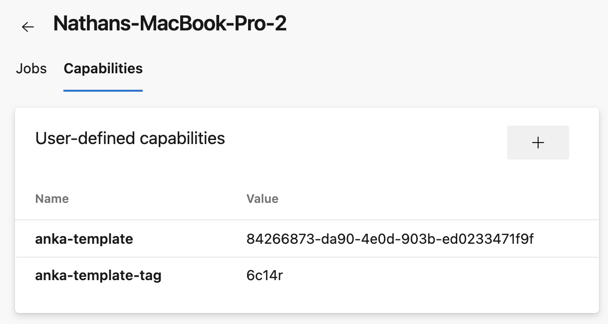
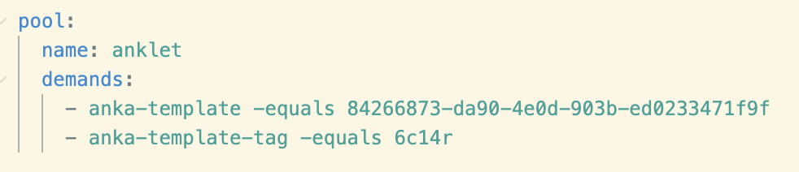

# Azure DevOps

## Current Blockers

- Azure requires agents to already exist, otherwise it errors when you first run the job. The issue is that to prevent Job 1 from using Job 2's VM when both are trying to use the same template and tag, we have to use some sort of job specific ID and pass it through. The problem with that is that it's impossible to create the offline agent for that.

## Prerequisites

1. Azure DevOps requires at least one registered agent PER TEMPLATE AND TAG capability to be present in the pool. Otherwise, you'll see "No agent found in pool anklet which satisfies the specified demands" errors. You'll need to manually create them by registering agents to the pool using your local machine (or a temporary remote machine). You can keep it offline, it just needs to show up in the pool. Once an offline agent is registered, add the specific capabilities your job will demand, the pipeline jobs you run will queue up without error and wait for anklet to register a new online agent with those same demands/capabilities inside of an Anka VM.

    
    

2. A machine that can receive webhooks from Azure DevOps using the Anklet Receiver plugin. This can be a linux or macOS machine.
3. MacOS machines that will run the Anka CLI and the Anklet Handler plugin.

## Pinning a job to its VM

To bind a job to one specific VM (so no other agent in the pool can pick it up), declare an `Agent.Name -equals $(Build.BuildId)` demand alongside the template demands:

```yaml
pool:
  name: anklet
  demands:
    - anka-template -equals <vm-template-uuid>
    - anka-template-tag -equals <tag>           # optional
    - Agent.Name -equals $(Build.BuildId)
```

The handler registers each agent with `--agent <Build.BuildId>`, so the dispatcher can only assign that build's jobs to the VM Anklet provisioned for it. `$(Build.BuildId)` is one of the few system variables that is resolved at dispatch time (when demands are matched), which is what makes this work.

> [!WARNING]
> **Multi-job builds share a `Build.BuildId`.**
>
> If your pipeline has multiple jobs that all run on Anklet (parallel jobs, matrix expansion, multiple stages) AND they share the same `anka-template` / `anka-template-tag`, the `Agent.Name -equals $(Build.BuildId)` demand cannot distinguish between them. Job A's VM could pick up job B and vice versa within the same build.
>
> What you still get even in this case:
> - No two jobs ever run on the same VM (`run.sh --once` ephemerality).
> - Jobs from a *different* build can never land on this VM (Build.BuildId mismatches).
> - Jobs requiring a *different* template can never land on this VM (`anka-template` mismatch).
>
> Workarounds for strict per-job binding in multi-job builds:
> - Split parallel jobs into separate pipelines (each gets its own `Build.BuildId`).
> - Differentiate sibling jobs by template/tag if they have meaningfully different needs.
> - Open an issue if this is blocking — we can implement a per-job parameter-injected token (Option C in the design discussion) where the trigger supplies a unique `anka-pin` value the handler reads back as a capability.